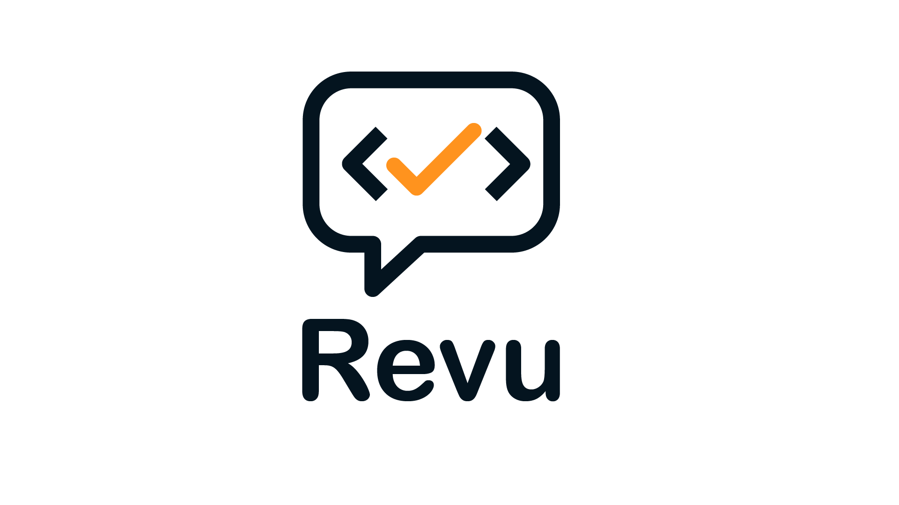

# Napkin Tools: ReVu

> 🤖 Self-hosted AI code review для ваших Pull Requests.


[](https://t.me/press_any_button)
[](https://t.me/writeanynotes)
[](https://t.me/+Li2vbxfWo0Q4ZDk6)

<p align="center">
  
</p>

---

## Оглавление

1. [О проекте](#о-проекте)
2. [Ключевые возможности](#ключевые-возможности)
3. [Технологии](#технологии)
4. [ToDo](#todo)
5. [Быстрый старт](#быстрый-старт)
6. [Автор](#автор)
7. [Поддержка](#поддержка)
8. [Лицензия](#лицензия)

---

## О проекте

ReVu — это self-hosted вебхук-сервис для автоматического code review с помощью ИИ.
Он принимает вебхуки от Git-провайдеров (сейчас поддерживаются GitHub и Gitea, другие — в планах), анализирует изменения
в Pull Request и публикует результат прямо в PR.

> **Основная идея** — разгрузить команду и повысить качество кода. Прежде чем ваш коллега возьмётся за ревью, PR уже
> проверит ИИ и укажет на потенциальные проблемы.
> ReVu — не сторонний сервис, а self-hosted инструмент, который вы разворачиваете у себя.

---

## Ключевые возможности

* **Два режима работы**
    * **Комментарий (`comment`)** — единый подробный отзыв по всему Pull Request.
    * **Инлайн (`inline`)** — точечные комментарии к конкретным изменениям в коде.
* **Гибкая интеграция**
    * Поддержка **GitHub** и **Gitea** (расширение до GitLab, Bitbucket и др. в планах).
    * Совместимость с **OpenAI API** и его альтернативами (OpenRouter, LocalAI и др.).
* **Полностью self-hosted**
    * Разворачивается на ваших серверах без передачи данных третьим лицам.
    * Можно использовать локальные модели (например, DeepSeek, Qwen), запуская их отдельно в вашей инфраструктуре.
* **Простая конфигурация**
    * Настройка через один YAML-файл.
    * Возможность задать количество повторов при неудачных запросах и таймауты.

---

## Технологии

* **FastAPI** (Python 3.13) — API и вебхук-обработчик
* **HTTPX** — HTTP-клиент для работы с Git- и AI-провайдерами
* **OpenAI SDK** — интеграция с LLM
* **Docker** — для удобного развертывания

---

## ToDo

- [ ] Поддержка других Git-провайдеров:
    - GitLab
    - Bitbucket
    - GitVerse
- [ ] Поддержка дополнительных AI-провайдеров:
    - [ ] Gemini
    - [ ] DeepSeek
    - [ ] Anthropic
    - [ ] Qween
    - [ ] GigaChat
    - [ ] YandexGPT
- [ ] Гибкая настройка кастомных промптов для ревью
- [ ] Подробная документация по конфигурации и запуску
- [ ] Англоязычная версия README
- [ ] Покрытие тестами

---

## Требования

Для корректной работы ReVu потребуется:

- **Доменное имя с настроенным SSL-сертификатом**
    - Обязательно при использовании GitHub или при удалённом подключении к Gitea.
    - Если Gitea и ReVu работают на одном сервере — можно использовать Docker-сеть без SSL.

- **Персональный токен доступа (PAT) от вашего Git-провайдера**
    - Для GitHub требуется именно **PAT Classic** с правами на `repo`.
    - Для Gitea достаточно токена с доступом к Pull Requests и репозиторию.

- **API-ключ от ИИ-провайдера**
    - Сейчас поддерживаются **OpenAI API** и совместимые сервисы (OpenRouter, LocalAI).

---

## Быстрый старт

Для того чтобы запустить проект, достаточно выполнить несколько шагов:

1. Подключитесь по SSH к серверу и в удобном месте создайте директорию для проекта:
    ```bash
    mkdir revu && cd revu
    ```
2. Скачайте конфигурационный файл и пропишите настройки:
    1. Скачайте файл:
        - Упрощённый:
          ```bash
          mkdir -p config && wget -O settings.yaml https://raw.githubusercontent.com/proDreams/revu/refs/heads/main/config/settings.yaml.example
          ```
        - Полный:
          ```bash
          mkdir -p config && wget -O settings.yaml https://raw.githubusercontent.com/proDreams/revu/refs/heads/main/config/settings.yaml.example_full
          ```
    2. Откройте файл для редактирования:
       ```bash
       nano settings.yaml
       ```
    3. Заполните следующие параметры:
        - `REVIEW_MODE` - формат ревью. Доступные варианты:
            - `"comment"` - один большой комментарий к Pull Request
            - `"inline"` - точечные комментарии к конкретным участкам кода
        - `GIT_PROVIDER_CONFIG` - настройки Git-провайдера:
            - `GIT_PROVIDER` - используемый Git-провайдер. Доступные варианты:
                - `"github"`
                - `"gitea"`
            - `GIT_PROVIDER_USER_TOKEN` - персональный токен доступа (PAT) от вашего Git-провайдера
            - (необязательно) `GIT_PROVIDER_URL` - URL Git-провайдера. Применяется к Gitea.
            - `GIT_PROVIDER_SECRET_TOKEN` - случайный набор символов. Используется для валидации входящего вебхука от
              Git-провайдера.
        - `AI_PROVIDER_CONFIG` - настройки ИИ-провайдера:
            - `AI_PROVIDER` - используемый ИИ-провайдер. Доступные варианты:
                - `"openai"` - официальный API от OpenAI
                - `"openai_compatible"` - совместимый с OpenAI провайдер
            - `AI_PROVIDER_API_KEY` - API Ключ от ИИ-провайдера
            - (необязательно) `AI_PROVIDER_BASE_URL` - URL от OpenAI-совместимого провайдера
            - `AI_PROVIDER_MODEL` - используемая модель (например, `gpt-4o-mini`)
        - `LOG_LEVEL` - уровень логирования (`DEBUG`, `INFO`, `WARNING`, `ERROR`, `CRITICAL`)
    4. Сохраните и выйдите, нажав CTRL+S, затем CTRL+X.
3. Скачайте docker-compose-файл:
    ```bash
    wget -O docker-compose.yaml https://raw.githubusercontent.com/proDreams/revu/refs/heads/main/docker-compose.yaml
    ```
4. Запустите проект:
    ```bash
    sudo docker compose up -d
    ```
5. Настройте reverse-proxy (Caddy, NGINX и др.):
    - Обязательно при работе с публичным GitHub.
    - Если Gitea и ReVu в одной Docker-сети, прокси можно не использовать.

### Обновление

Для обновления достаточно выполнить команду:

```bash
sudo docker compose pull && sudo docker compose up -d
```

## Автор

- [Иван Ашихмин](https://t.me/proDreams)

Программа написана в рамках проекта "Код на салфетке":

- Сайт: https://pressanybutton.ru/
- Telegram-канал: https://t.me/press_any_button

---

## Поддержка

Если вам нравится этот проект и вы хотите поддержать его дальнейшее развитие, рассмотрите возможность доната:

- [Поддержать через YooMoney](https://yoomoney.ru/to/41001431694461)
- [Поддержать через Tribute в Telegram](https://t.me/tribute/app?startapp=dyds)
- [Поддержать через наш Telegram-бот](https://t.me/press_any_button_bot?start=donate)

Ваша поддержка помогает проекту развиваться и улучшать будущие функции!

---

## Лицензия

Этот проект распространяется под лицензией MIT. Подробности можно найти в файле [LICENSE](LICENSE).
